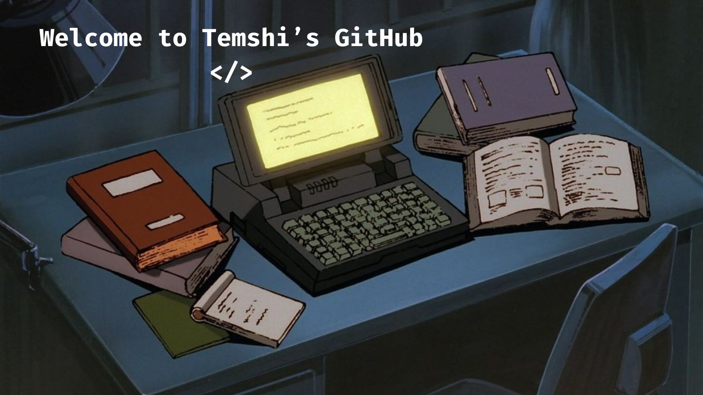
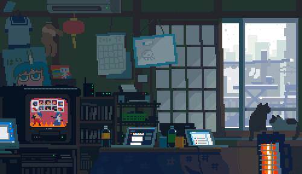

  

&nbsp;

 

---

## `about`

<table>
 <tr>
  <td width"65%" valign="middle">
   

    Hello!  
    I am Temshinaro Jamir, an Electronics & Communication Engineering Student. I enjoy learning new tech and problem solving. I love working on social projects that matters.   
    Now I'm building practical projects, understanding how things work, and turning theory into something tangible.
     
    Interested in the space where <b>hardware × software × data</b> meet.
     
   Currently exploring <b>IoT · Embedded Systems · RF · Antennas · AWS</b>
   

  </td>
  <td width="35%" align="center">
   
  </td>
 </tr>
</table>

 

---

## `arsenal`

 

---

## `things i've built`

<table>
<tr>

<td width="50%" valign="top">

###  IoT Smart Greywater Reuse System

An IoT-based system for monitoring water quality and automating
greywater reuse using sensors and an ESP32.

**Built with**

`ESP32` `IoT` `Sensors`

`Embedded Systems` `Automation`

</td>

<td width="50%" valign="top">

### 2.4 GHz Rectangular Dielectric Resonator Antenna

Designed, simulated, optimized and fabricated a compact RDRA
for 2.4 GHz wireless applications.

The design uses a microstrip feed and top copper plate loading
for miniaturization and frequency tuning.

**Built with**

`CST Studio Suite` `RF` `Antenna Design`

`S-Parameters` `VNA` `2.4 GHz`

</td>

</tr>

<tr>

<td width="50%" valign="top">

### AWS & Cloud

Exploring AWS and cloud computing, with an interest in applying
cloud technologies to IoT and data-driven systems.

**Exploring**

`AWS` `Cloud Computing`

`IoT` `Data`

</td>

<td width="50%" valign="top">

### Electronics & Communication

Exploring RF systems, wireless communication, embedded systems
and practical electronics through academic and personal projects.

**Interests**

`RF` `Antennas` `IoT`

`Embedded` `Wireless`

</td>

</tr>
</table>

 

---

## `currently exploring`

 <b>AWS & Cloud Computing</b>
 &nbsp;&nbsp; · &nbsp;&nbsp;
 <b>RF & Antenna Systems</b>
&nbsp;&nbsp; · &nbsp;&nbsp;
 <b>IoT & Embedded Systems</b>
 &nbsp;&nbsp; · &nbsp;&nbsp;
 <b>Data Analytics</b>
 
 <b>Programming</b>
&nbsp;&nbsp; · &nbsp;&nbsp;
 <b>Wireless Communication</b>

 

---

## `github activity`

 

---

## `beyond the terminal`

 

Photography · Reading · Exploring 

 

---

 

<i>until next time....</i>

